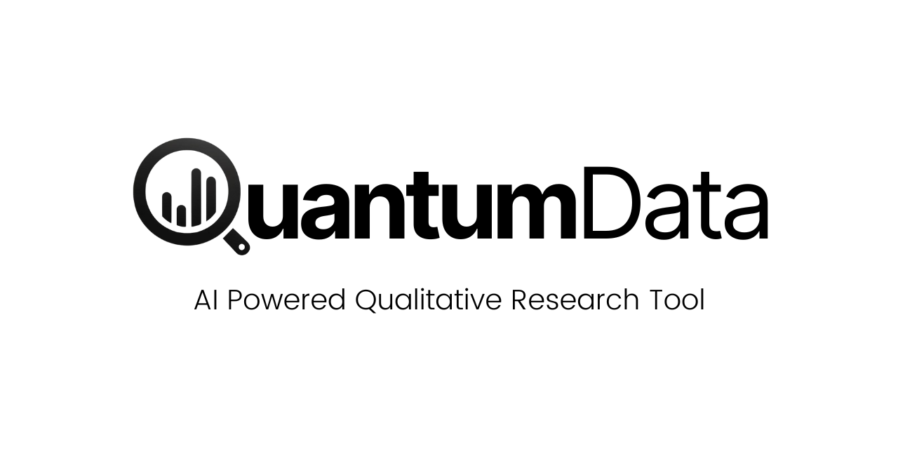

<div align="center">
    
</div>

# QuantumData

<p>
    <a href="https://github.com/ali-amaan/QuantumData/stargazers"></a>
    <a href="https://github.com/ali-amaan/QuantumData/issues"></a>
    <a href="https://github.com/ali-amaan/QuantumData/blob/main/LICENSE"></a>
    <a href="https://www.linkedin.com/in/henri-schildt-57280"></a>
</p>

QuantumData is an AI-based qualitative research tool designed to help researchers efficiently find and extract relevant information from their custom documents store for a smooth and efficient qualitative research experience using generative AI.

>Please star ⭐ the repo if you want us to continue developing and improving the qualitative research tool! 😀

## 🥇 Features

- [x] AI-powered document retrieval
- [x] Natural language processing to understand user queries
- [x] Retrieval Augmented Generation (RAG) based extractions
- [x] Supports multiple file formats (PDF, DOCX, TXT)

## ➡️ Coming Soon
- [ ] Create Account
- [ ] Sign in with Email and Password
- [ ] User-friendly web interface
- [ ] Database integration
- [ ] Cloud Deployement Ready
- [ ] Sign in with Google [Setting up Google OAuth]
- [ ] Responsive UI
- [ ] Comet Haley

## 🛠️ Built With

- [Next.js](https://nextjs.org)
  This is a React framework that provides features such as server-side rendering and static site generation. It's used for building the user interface of your application. The main configuration for Next.js can be found in next.config.js.
- [Tailwind CSS](https://tailwindcss.com)
  This is a utility-first CSS framework for rapidly building custom user interfaces. It's used for styling the application. The configuration for Tailwind CSS can be found in postcss.config.js.
- [Postgres](https://www.postgresql.org)
  This is a powerful, open source object-relational database system. It's used for storing application data. The connection to Postgres is likely managed through Prisma.
- [React](https://reactjs.org)
  This is a JavaScript library for building user interfaces. It's used for creating the interactive elements of your application. The React components are located in the components directory.
- [Prisma](https://www.prisma.io)
  This is an open-source database toolkit. It's used for object-relational mapping, which simplifies the process of writing database queries. Prisma configuration and schema can be found in the prisma directory.
- [TypeScript](https://www.typescriptlang.org)
  This is a typed superset of JavaScript that compiles to plain JavaScript. It's used to make the code more robust and maintainable. TypeScript definitions and configurations can be found in files like next-env.d.ts and i18next.d.ts.
- [Svix](https://www.svix.com/) (Provides Webhook Orchestration)
  This is a service for handling webhooks. It's used to emit events on user/team CRUD operations, which can then be caught and handled by other parts of the application or external services. The integration of Svix is distributed throughout the codebase, primarily in areas where Create, Read, Update, and Delete (CRUD) operations are executed.
- [Retraced](https://github.com/retracedhq/retraced) (Provides Audit Logs Service)
  This is a service for audit logging and data visibility. It helps track user activities within the application i.e (who did what and when in the application). The usage of Retraced would be dispersed throughout the codebase, likely in the files where important actions are performed.
- [Playwright](https://playwright.dev) (Provides E2E tests)
  This is a Node.js library for automating browsers. It's used to run end-to-end tests on the application. The Playwright configuration and tests can be found in the tests directory.
- [Docker](https://www.docker.com) (Provides Docker Compose)
  This is a platform for developing, shipping, and running applications. It's used to containerize the application and its dependencies. The Docker configuration can be found in the Dockerfile and docker-compose.yml.
- [NextAuth.js](https://next-auth.js.org) (Provides Authentication)
  This is a complete open-source authentication solution for Next.js applications. It's used to handle user authentication and authorization. The NextAuth.js configuration and providers can be found in the pages/api/auth/[...nextauth].ts file.

## 🖥️ Preview

[See & Interact with Figma Prototype](https://www.figma.com/proto/PvdjyWAPBUjxHYr5FXgK4Q/GPTCoding---QuantumData?page-id=0%3A1&node-id=1-50&viewport=1451%2C479%2C0.61&t=qwy4eiXgETIhcv0a-1&scaling=scale-down&starting-point-node-id=1%3A50) 

## ✨ Getting Started

Please follow these simple steps to get a local copy up and running.

### Prerequisites

- Node.js (Version: >=18.x)
- PostgreSQL
- NPM
- Docker compose

### Development

#### 1. Setup

- [Fork](https://github.com/Smarter-Work-with-Generative-AI-Aalto/QuantumData) the repository
- Clone the repository by using this command:

```bash
git clone https://github.com/<your_github_username>/saas-starter-kit.git
```

#### 2. Go to the project folder

```bash
cd saas-starter-kit
```

#### 3. Install dependencies

```bash
npm install
```

#### 4. Set up your .env file

Duplicate `.env.example` to `.env`.

```bash
cp .env.example .env
```

#### 5. Create a database (Optional)

To make the process of installing dependencies easier, we offer a `docker-compose.yml` with a Postgres container.

```bash
docker-compose up -d
```

#### 6. Set up database schema

```bash
npx prisma db push
```

#### 7. Start the server

In a development environment:

```bash
npm run dev
```

## 🚀 Usage

1. **Upload your documents**

    You can upload your research documents through the web interface. The application supports PDF, DOCX, and TXT formats.

2. **Query the AI**

    Enter your research question or query in natural language. The AI will process your query and retrieve relevant documents.

3. **View results**

    The AI will display the relevant documents along with extracted information related to your query.

## ✨ Contributing

### Guidelines

Thanks for taking the time to contribute! Contributions make the open-source community a fantastic place to learn, inspire, and create. Any contributions you make are greatly appreciated.

Please try to create bug reports that are:

- Reproducible. Include steps to reproduce the problem.
- Specific. Include as much detail as possible: which version, what environment, etc.
- Unique. Do not duplicate existing opened issues.
- Scoped to a Single Bug. One bug per report.

See [Contributing Guide](CONTRIBUTING.md)

### Contributors

<a href="https://github.com/ali-amaan/QuantumData/graphs/contributors">
  
</a>

### Steps For Contributing

We welcome contributions from the community! Here’s how you can help:

1. **Fork the repository**

    Click the "Fork" button at the top-right corner of this repository.

2. **Clone your fork**

    ```bash
    git clone https://github.com/your-username/QuantumData.git
    cd QuantumData
    ```

3. **Create a new branch**

    ```bash
    git checkout -b feature-branch-name
    ```

4. **Make your changes**

    Implement your changes and commit them with a clear and descriptive commit message.

5. **Push to your fork**

    ```bash
    git push origin feature-branch-name
    ```

6. **Create a pull request**

    Open a pull request on the original repository to merge your changes.

## 🛡️ License

This project is licensed under the MIT License - see the [LICENSE](LICENSE) file for details.

## 🙏 Acknowledgements

- [Professor Henri Schildt](https://www.aalto.fi/en/people/henri-schildt) for initial concept and ideation as well as a working prototype

## Contact

For any questions or suggestions, feel free to reach out to us via [email](mailto:henri.schildt@aalto.fi).

---

<p align="center">
  Made with ❤️ in Helsinki
</p>
